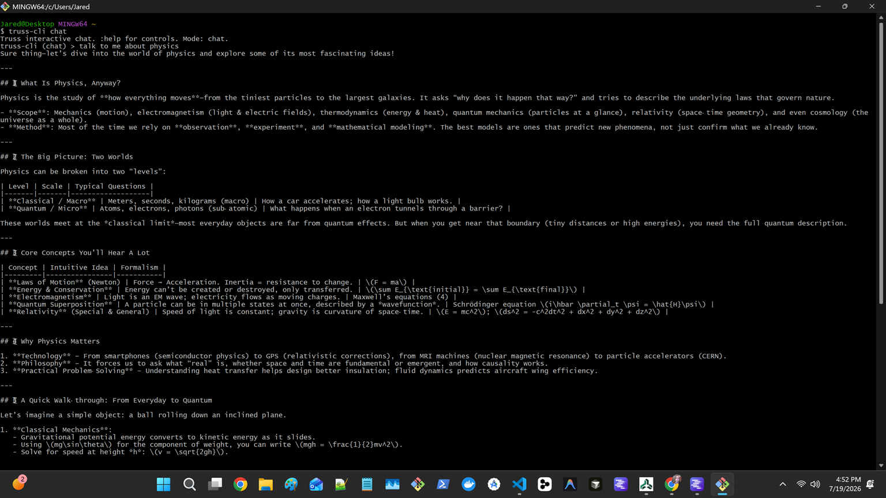
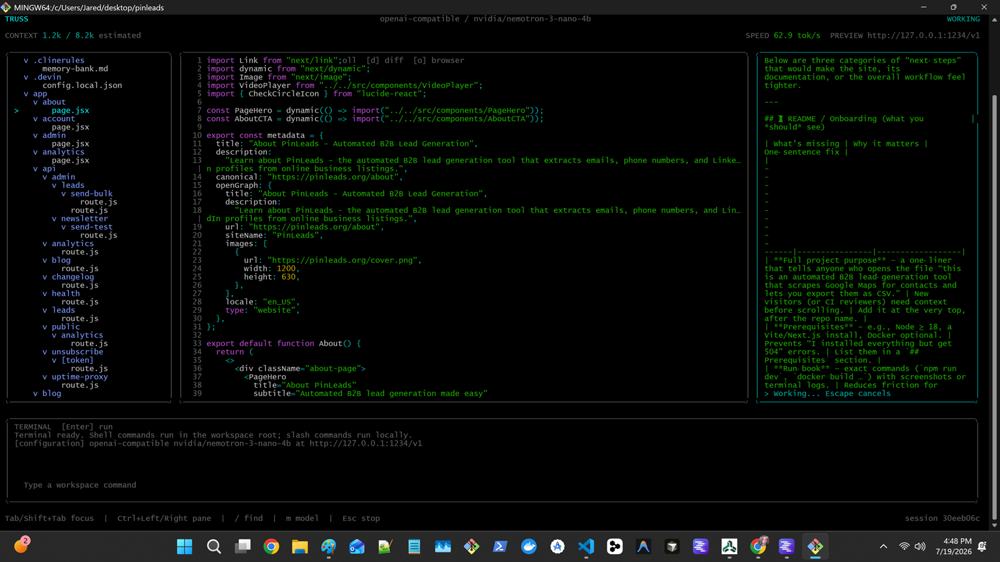
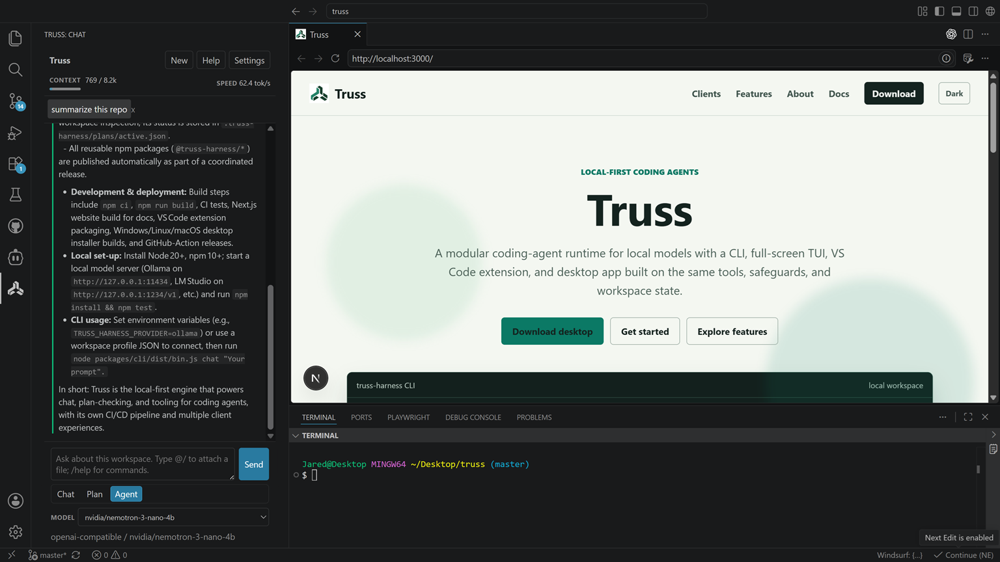
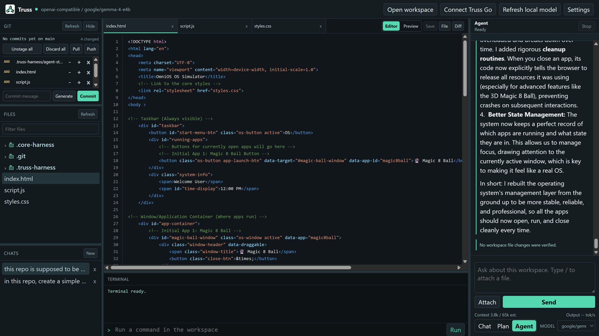

# Truss

Truss is a local-first, provider-neutral coding-agent platform. Use the same
models, tools, permissions, workspace memory, and plans from the command line,
terminal, VS Code, or a dedicated desktop workspace.

Create multiple workspace-local managed-agent profiles when a task benefits
from separate models or providers. Chat and Plan agents can work concurrently;
Edit agents are serialized through a workspace write lease so they cannot
mutate the same workspace at the same time.

Bring an Ollama, LM Studio, llama.cpp, or compatible endpoint—or configure a
supported cloud provider with your own API key. Truss does not require a hosted
control plane.

## Choose a client

| Client | Best for | Install |
| --- | --- | --- |
| CLI | Scripts and focused coding tasks | npm install --global @truss-harness/cli |
| Terminal UI | Keyboard-first work in the terminal | npm install --global @truss-harness/tui |
| VS Code | Chat, file context, completions, and approvals in the editor | [Install from the Marketplace](https://marketplace.visualstudio.com/items?itemName=truss-harness.truss-harness-vscode) |
| Desktop | A dedicated workspace with files, diffs, terminal, Git, and chat | [Download Truss Desktop](https://truss-agent.com/download) |
| Truss Go | Continue a trusted Desktop or VS Code session from Android | [Explore Truss Go](https://truss-agent.com/truss-go) |

## Managed agents

Desktop, VS Code, the CLI, and a host-authorized Truss Go connection can
control independent workspace-local agent profiles. Each profile has its own
provider, endpoint, model, mode, and approval policy while credentials remain
with the host. Read the [managed-agent guide](https://truss-agent.com/docs/runtime/managed-agents)
for run policy, safety behavior, and CLI commands.

### CLI

Use the CLI for direct tasks, scripts, and automations.

~~~sh
npm install --global @truss-harness/cli
truss-cli models
truss-cli chat "Review the current diff"
~~~

### Terminal UI

The terminal UI combines chat, files, editing, Git diffs, shell output, model
controls, and approvals in one keyboard-first workspace.

~~~sh
npm install --global @truss-harness/tui
truss-tui
~~~

### VS Code

Install the [Truss VS Code extension](https://marketplace.visualstudio.com/items?itemName=truss-harness.truss-harness-vscode), open the Truss Activity Bar view, then select a detected local server or enter your endpoint and model. The extension supports streaming chat, focused file context, inline completions, agent modes, Git-aware actions, and tool approvals.

### Desktop

[Download Truss Desktop](https://truss-agent.com/download) for Windows or Linux. Open a workspace, choose **Settings**, configure a model endpoint, and select a model. The desktop app includes files, editor and diff views, a terminal, Git controls, persistent chat, MCP settings, and approval controls.

## Quick start

1. Start a compatible model server. Ollama is the simplest option; LM Studio,
   llama.cpp, and other OpenAI-compatible servers also work.
2. Install the CLI or terminal UI, or install the VS Code extension or desktop
   app.
3. Let Truss discover your local server, or configure a profile explicitly.

Ollama is detected at http://127.0.0.1:11434. Compatible servers are also
probed at common LM Studio and llama.cpp addresses. Check what Truss finds:

~~~sh
truss-cli models
~~~

## Configuration

The CLI and terminal UI share JSON configuration files. Run these commands to
see the active user and workspace locations, then create a safe workspace
template:

~~~sh
truss-cli config path
truss-cli config init
~~~

Example .truss-harness/config.json:

~~~json
{
  "defaultProfile": "ollama-coder",
  "profiles": {
    "ollama-coder": {
      "provider": "ollama",
      "baseUrl": "http://127.0.0.1:11434",
      "model": "qwen3:8b",
      "mode": "edit",
      "permission": "ask",
      "internetAccess": false
    },
    "lm-studio-fast": {
      "provider": "openai-compatible",
      "baseUrl": "http://127.0.0.1:1234/v1",
      "model": "local-model-id",
      "mode": "plan",
      "permission": "auto-read"
    }
  }
}
~~~

Use a profile for a task:

~~~sh
truss-cli chat --profile ollama-coder "Explain the runtime architecture"
truss-cli chat --profile lm-studio-fast --mode edit "Update the tests"
~~~

You can also configure a one-off session with environment variables:

| Variable | Purpose |
| --- | --- |
| TRUSS_HARNESS_PROVIDER | ollama or openai-compatible; defaults to ollama |
| TRUSS_HARNESS_BASE_URL | Model server base URL |
| TRUSS_HARNESS_MODEL | Model name or ID |
| TRUSS_HARNESS_API_KEY | Optional token for a protected endpoint |
| TRUSS_HARNESS_SYSTEM_PROMPT | Optional system prompt |
| TRUSS_HARNESS_MCP_SERVERS | Optional JSON object containing local MCP servers |

The Desktop app and VS Code extension keep endpoint, model, mode, and
permission choices in their own settings. API keys should stay in the client’s
credential flow or environment variables—never commit them to a workspace
configuration file.

## Modes and approvals

Choose the mode that fits the task:

| Mode | Access |
| --- | --- |
| Chat | Conversation only; no workspace tools |
| Plan | Read-only workspace inspection |
| Edit | Reads, writes, search, grep, and terminal execution |

Tool permissions are independent from mode. Use **Ask every time** to approve
each action, **Auto-allow read-only** to approve safe inspection automatically,
or **Auto-allow all tools** only in a workspace you trust.

## MCP servers

Truss can load local Model Context Protocol servers over stdio. Desktop has an
MCP manager in Settings, and VS Code provides **Truss: Manage MCP Servers**.
CLI/TUI users can add the same definitions to their shared configuration:

~~~json
{
  "mcpServers": {
    "filesystem": {
      "command": "npx",
      "args": ["-y", "@modelcontextprotocol/server-filesystem", "."],
      "cwd": ".",
      "enabled": true,
      "readOnly": true
    }
  }
}
~~~

Chat mode does not load MCP tools. Plan mode loads only servers marked
readOnly; Edit mode loads every enabled server. Workspace MCP definitions are
ignored by default because they can start local processes; explicitly trust
them with "allowWorkspaceMcpServers": true in your user configuration when
appropriate.

Use `truss-cli mcp status`, `truss-cli mcp tools`, or
`truss-cli mcp reconnect <name>` for safe terminal diagnostics. The TUI opens
the same credential-safe server/tool status with `c`. Paired Truss Go clients
can view status, but server commands, environment values, and credentials stay
on the host.

## Learn more

- [Documentation](https://truss-agent.com/docs)
- [Getting started](https://truss-agent.com/docs/getting-started)
- [Client guides](https://truss-agent.com/clients)
- [Download Truss Desktop](https://truss-agent.com/download)
- [GitHub issues](https://github.com/truss-agent/truss-harness/issues)

Truss is actively developed. Contributions and feedback are welcome.
